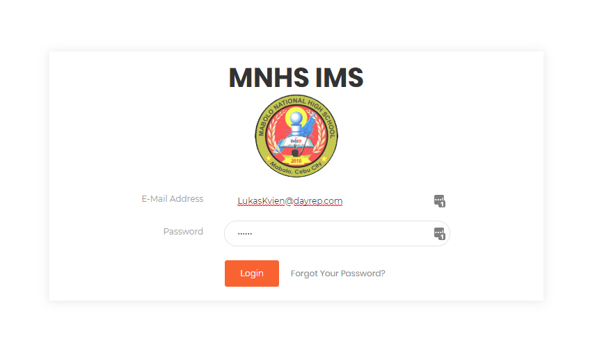
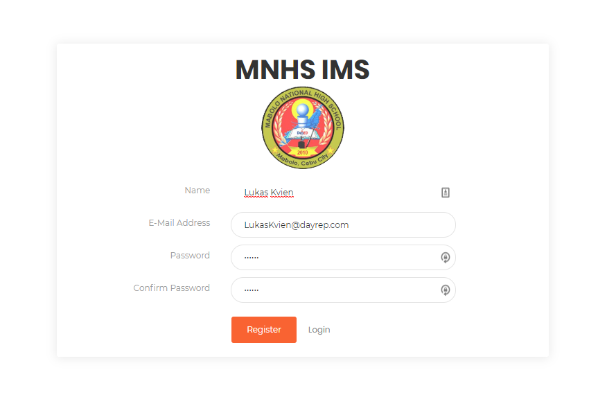
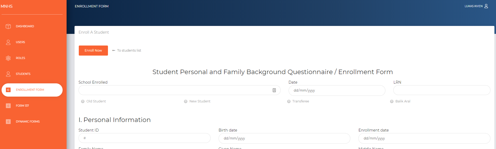

# Mabolo National High School   
## Student Management System   

## Setup Libraries in this sequence  

1. `composer install` (if live server) or `composer update` (if local)    
2. `npm install` (if local)     
3.  Please copy `.env.example` and create another `.env`  
4. `php artisan key:generate`   
5. Create database name `mnhs` and make sure the `mnhs` database has no tables before going to step #6      
6. `php artisan migrate --path=database/migrations/2019_07_15_151545_roles_table.php`  
7. `php artisan migrate`  
8. `php artisan migrate --path=database/migrations/persons && php artisan migrate --path=database/migrations/students`   

## Setup default values  
9. `php artisan db:seed`       

## Run  
10. `php artisan serve`  

## For !local! development only  
11. `npm run watch` to run vue.js and compile the javascripts   

## For re-setting with existing database  
1. `php artisan migrate:fresh --path=database/migrations/2019_07_15_151545_roles_table.php && php artisan migrate && php artisan migrate --path=database/migrations/persons && php artisan migrate --path=database/migrations/students && php artisan db:seed`  

# Admin UI  
## Login    

   

## Register  

   

## Enrollment Form  

   

## 137 Form  

   

## 137 Form  

   

# Notes:  
php artisan make:migration students_eligibility_for_jhs_enrollment --path=database/migrations/students  
php artisan make:migration persons --path=database/migrations/persons  
php artisan make:model Models/Students/StudentsEligibilityJHSEnrollment  
php artisan make:model Models/Students/StudentsOtherCredentialsPresented  